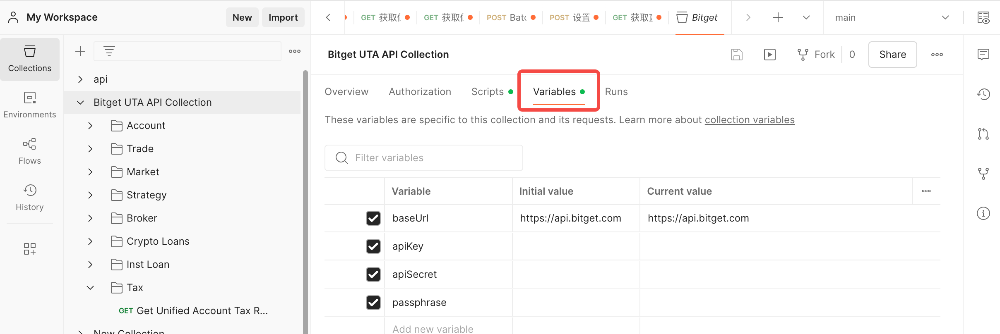

# QuickStartWithPostman

## Disclaimer

This collection is provided for your testing and development purposes only. The testing tool may require your API keys which is strictly limited to your own device that is accessible to you only. You are solely responsible for ensuring the security of all API keys according to our API Terms of Use to prevent unauthorized access. Bitget has no control over any third-party application, including but not limited to the Postman testing tool. We are not responsible for any loss or damage arising from your use of this collection or any API testing tool.

### Security Measures

- Do not enable any cloud sync or website usage to prevent third parties from accessing your API keys. Use your local device that is accessible to you only.
- Do not reuse any API keys after the testing.
- Do not enable trading or withdrawal permissions for read-only use cases.
- Disable withdrawal permissions on API keys.
- Enable IP whitelisting to restrict usage to known and trusted IP addresses that is only accessible to you.
- Change API keys regularly and immediately remove API keys that may be exposed or compromised.
- Store credentials in environment files that are gitignored and excluded from version control.

---

## English

[Postman](https://www.postman.com/) is an API collaboration platform. Please access https://www.postman.com/ to download and install the client locally. (There's also a web version so please visit their website to find out more details.)

### How to import

- Download the JSON file (`git clone` is recommended) from https://github.com/BitgetLimited/QuickStartWithPostman.
- The JSON file contains both the collection and the environment variables, so you only need to import it once.
- Import the JSON file into the Postman app.

### How to configure variables

- After importing, click on the **Bitget UTA API Collection**, then go to the **Variables** tab.
- Update the following variables accordingly:

| Variable | Description |
|---|---|
| `baseUrl` | API base URL. Default is `https://api.bitget.com`. |
| `apiKey` | Your API key. |
| `apiSecret` | Your API secret key. |
| `passphrase` | Your API passphrase. |

---

## 免责声明

本集合仅供您测试和开发使用。测试工具可能需要您的 API 密钥，该密钥仅限于您本人可访问的设备上使用。根据我们的 API 使用条款，您需自行负责确保所有 API 密钥的安全，以防止未经授权的访问。Bitget 对任何第三方应用程序（包括但不限于 Postman 测试工具）不承担任何责任。对于因使用本集合或任何 API 测试工具而造成的任何损失或损害，我们概不负责。

### 安全措施

- 请勿开启任何云同步或网页使用功能，以防止第三方访问您的 API 密钥。请仅在您本人可访问的本地设备上使用。
- 测试完成后请勿重复使用任何 API 密钥。
- 仅用于只读场景时，请勿开启交易或提币权限。
- 请禁用 API 密钥的提币权限。
- 启用 IP 白名单，将使用限制在您本人可访问的已知可信 IP 地址。
- 定期更换 API 密钥，并立即删除可能已泄露或遭到入侵的 API 密钥。
- 将凭证存储在已添加至 `.gitignore` 且被版本控制排除的环境文件中。

---

## 中文

[Postman](https://www.postman.com/) 是一个 API 协作平台。请访问 https://www.postman.com/ 下载并在本地安装客户端。（也有网页版，请访问其官网了解更多详情。）

### 如何导入

- 从 https://github.com/BitgetLimited/QuickStartWithPostman 下载 JSON 文件（推荐使用 `git clone`）。
- 该 JSON 文件同时包含集合（Collection）和环境变量，只需导入一次即可。
- 将 JSON 文件导入 Postman 应用。

### 如何配置变量

- 导入成功后，点击 **Bitget UTA API Collection**，然后进入 **Variables** 标签页。
- 按照实际情况更新以下变量：

| 变量 | 说明 |
|---|---|
| `baseUrl` | API 基础 URL，默认为 `https://api.bitget.com`。 |
| `apiKey` | 您的 API key。 |
| `apiSecret` | 您的 API secret key。 |
| `passphrase` | 您的 API passphrase。 |

